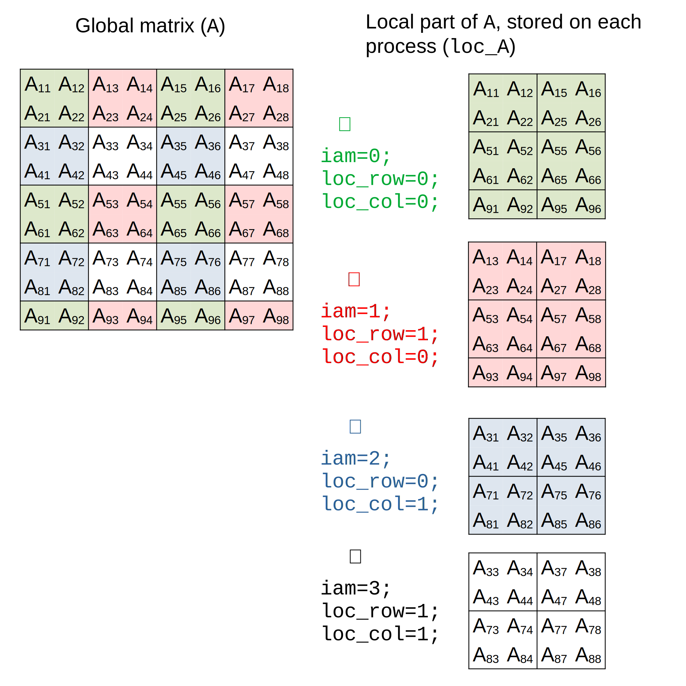

# A gentle introduction to (sca)LAPACK(e)

!!! Info

    Information on scaLAPACK is sparse online, with most resources limited to a few blog posts or StackOverflow questions. The most comprehensive source of information is the [scaLAPACK User's Guide](https://netlib.org/scalapack/slug/index.html).

    The most detailed documentation for understanding the usage of each argument is often found in the [source code of the reference implementation](https://github.com/Reference-ScaLAPACK/scalapack), which isn't the most user-friendly approach.

    This document aims to guide you through the somewhat obscure world of scaLAPACK, providing helpful insights along the way.

## The linear algebra ecosystem of LAPACK and friends

Before diving into some code, it is important to understand from where this scaLAPACK thing comes from, why it is so important, and how to use it in the first place.

### A "historical" perspective

Basic linear algebra operations, such as matrix and vector manipulations, form the backbone of many scientific applications. 
However, when it comes to more complex tasks like finding eigenvalues, solving systems of equations, or matrix decompositions, the challenge increases significantly. 
Fortunately, these complex calculations often rely on a set of common low-level operations, known as *kernels*, such as matrix multiplication.

**[BLAS](https://en.wikipedia.org/wiki/Basic_Linear_Algebra_Subprograms)** (Basic Linear Algebra Subprograms) is a foundational library that provides these kernels for performing operations on and between vectors and matrices. 
BLAS is categorized into three "levels," which reflect its historical development:

1. **Level 1:** Vector operations (e.g., dot product, norm, addition).
2. **Level 2:** Matrix-vector operations (including matrix-vector multiplication).
3. **Level 3:** Matrix-matrix operations.

Indeed, the distinction between these levels is mainly historical: Level 1 was developed first, followed by Level 2, and so on.
It has no importance in practice.

**[LAPACK](https://en.wikipedia.org/wiki/LAPACK)** (Linear Algebra PACKage) builds on top of BLAS to perform the more complex operations mentioned earlier, like solving linear systems and eigenvalue problems.

The historical, or "reference," implementations of BLAS and LAPACK are hosted in the [netlib repository](https://www.netlib.org/), often referred to as *netlib BLAS & LAPACK* or simply *the* BLAS and LAPACK.

Due to their widespread use, the APIs (i.e., the definitions of routines and their behavior) of both BLAS and LAPACK have become *de facto* standards. 
While various implementations exist, they all adhere to the same API and behavior, allowing them to be (in theory) interchanged seamlessly. 
Different implementations focus on optimizing performance or leveraging modern accelerators like GPUs. 
BLAS, being the performance-critical component of LAPACK, has more implementations, including [OpenBLAS](https://www.openblas.net/), [ATLAS](https://math-atlas.sourceforge.net/), [BLIS](https://github.com/flame/blis), and [oneMKL](https://www.intel.com/content/www/us/en/developer/tools/oneapi/onemkl.html). 
Notably, oneMKL also includes an implementation of (sca)LAPACK.

As computing and supercomputing infrastructure evolved, the development of [distributed memory](https://en.wikipedia.org/wiki/Distributed_memory) systems became crucial. 
In these systems, each processor (or subset of processors) has access to local, typically private, memory. 
Since computations can only be performed on local data, communication between processors is necessary, leading to the development of the [Message Passing Interface](https://en.wikipedia.org/wiki/Message_Passing_Interface) (MPI). 
MPI is another standard that defines a common API for communication via messages. 
There are various MPI implementations, including [OpenMPI](https://www.open-mpi.org/) and [MPICH](https://www.mpich.org/).

Finally, **[scaLAPACK](https://en.wikipedia.org/wiki/ScaLAPACK)** is an implementation of a subset of LAPACK routines tailored for distributed memory systems. 
It is built on top of [**PBLAS**](https://en.wikipedia.org/wiki/PBLAS), which provides distributed-memory versions of BLAS routines. 
Both scaLAPACK and PBLAS are based on MPI but use an abstraction layer called **BLACS**. 
Although BLACS was designed to support other message-passing libraries like [PVM](https://en.wikipedia.org/wiki/Parallel_Virtual_Machine), MPI is the only choice today.

The resulting hierarchy of these building blocks is illustrated in the following diagram:


There do not exist a lot of implementation of scaLAPACK, which are generally the [*reference* implementation from netlib](https://www.netlib.org/scalapack/), but slightly tuned for performances.
One can mention [oneMKL](https://www.intel.com/content/www/us/en/developer/tools/oneapi/onemkl.html) and [AOCL](https://www.amd.com/en/developer/aocl/dense.html) (which also ships a BLAS and LAPACK implementation).

### Naming conventions in BLAS/LAPACK

BLAS and LAPACK subroutines are distinctive for two key reasons:

1. **Incredibly Short Names:** Typically written in uppercase (a legacy from Fortran), these names often resemble spells from a classic RPG. 
   In reality, they perform complex operations that can seem magical to non-programmers.

2. **Structured Naming Conventions:** Despite their brevity, these names follow a specific set of rules that provide meaningful information about the subroutine's function.

In BLAS and LAPACK, the naming convention is `<type><mattype><op>`, where:

- **`<type>`** refers to the data type the routine operates on:
    - `s`: Single precision real (`float`)
    - `d`: Double precision real (`double`)
    - `c`: Single precision complex (`float[2]`)
    - `z`: Double precision complex (`double[2]`)

- **`<mattype>`** specifies the type and storage format of the matrix (relevant only for matrix-related routines). For example:
    - `ge`: General matrix
    - `sy`: Symmetric matrix
    - `he`: Hermitian matrix
    - `tr`: Triangular matrix
    - Other formats like [band](https://netlib.org/lapack/lug/node124.html) (`gb`, `sb`, etc.) and [packed](https://netlib.org/lapack/lug/node123.html) storage (`sp`, `tp`, etc.) are also used for optimized routines.

     Note: Not all matrix types are available for every operation.

- **`<op>`** indicates the operation the routine performs. For example:
    - `mv`: Matrix-vector multiplication
    - `mm`: Matrix-matrix multiplication
    - `ev`: Eigenvalue computation
    - `svd`: Singular value decomposition

    Typically, BLAS handles basic matrix and vector operations, while LAPACK offers routines for more complex tasks like solving linear systems, eigenvalue problems, and singular value decomposition.

For reference, see [this document](https://netlib.org/lapack/lug/node145.html) for a list of BLAS routines. 
A list of LAPACK functions is also availble [here](https://www.maths.tcd.ie/~domijank/lapack.pdf).
Finally, an extensive list can be found [here](https://icl.utk.edu/~mgates3/docs/lapack.html), also providing information about the implementation in other libraries as well.

Several unspoken rules apply to the arguments in BLAS and LAPACK routines.

In general,

- `A`, `B`, `C`, etc., typically refer to matrices, while `W`, `X`, etc., refer to vectors.
- `ALPHA`, `BETA`, etc., represent scalar values.
- `M`, `N`, and `K` are used to denote the dimensions of vectors or matrices.
- `LDA`, `LDB`, etc., refer to the leading dimensions (the length of the first dimension) of matrices `A`, `B`, etc., which generally correspond to the number of rows.
- Common arguments like `TRANS`, `UPLO`, `DIAG`, and `SIDE` are used consistently across routines to indicate matrix properties (e.g., whether to transpose, how the matrix is stored, etc.).

In LAPACK,

- In order to avoid allocating memory for the output, it is not uncommon that the memory space of an input array which shares the dimension of the output is actually also the output.
- `WORK` is an auxiliary workspace array (single or double precision) that the user must allocate, with its size specified by `LWORK`. Similarly, `IWORK` and `LIWORK` refer to an integer workspace and its size.
  The required size of `LWORK` and `LIWORK` varies by routine and input; larger values generally lead to better performance. Setting `LWORK` to `-1` will return the optimal workspace size in `WORK[0]`, without performing the routine’s main computation.
- An `INFO < 0` return value indicates an error with the `i`-th parameter, while `INFO > 0` signals a failure in the algorithm.

These conventions make it easier to understand and use the routines.

### What about scaLAPACK?

The primary routines in PBLAS and scaLAPACK are prefixed with "P", followed by the name of their non-distributed counterpart. 
While these distributed routines require additional arguments to describe the layout of vectors and matrices (as explained below), they largely retain the logic and structure of their non-distributed versions (but check the documentation to verify it is the case).

For example, the [`(P)DGESV` routine](https://netlib.org/lapack/explore-html-3.6.1/d7/d3b/group__double_g_esolve_ga5ee879032a8365897c3ba91e3dc8d512.html) solve the system of linear equation $A\,X = B$ where $A$ is a `N`-by-`N` matrix and $B$ and $X$ are `N`-by-`NRHS` matrices:


In the diagram, the common parts are highlighted in green, showing an almost 1:1 correspondence between the non-distributed and distributed versions.

!!! warning

    Two important caveats to keep in mind:

    1. **Subset of LAPACK:** Since scaLAPACK is only a subset of LAPACK, some routines may be unavailable.
       Additionally, in terms of matrix storage, only dense, narrow band, and tridiagonal band matrices are supported.

    2. **Global vs. Local Arguments:** to use scaLAPACK, one needs to make a distinction between global and local arguments (see below), a difference that is not reflected in the naming of the arguments.
       This is the case in the example above with `NHRS`, which in its distributed version is the number of column of the **sub**matrix `B` (see the [source code](https://netlib.org/scalapack/explore-html/df/df8/pdgesv_8f_source.html)).

The list of available routine is given:

+ [here](https://netlib.org/scalapack/pblas_qref.html) for PBLAS, and
+ [here](https://netlib.org/scalapack/slug/node183.html) for scaLAPACK.

### C interfaces?

BLAS and (sca)LAPACK were originally written primarily in Fortran. To use them in C, several interfaces are available:

+ **[CBLAS](https://www.intel.com/content/www/us/en/docs/onemkl/developer-guide-windows/2023-0/call-blas-funcs-return-complex-values-in-c-code.html):** A C interface provided by most BLAS implementations, which has become a *de facto* standard.
+ **[LAPACKe](https://netlib.org/lapack/lapacke.html):** A C interface offered by the few implementations of LAPACK.
+ **scaLAPACKe:** This project, which aims to provide a similar C interface for scaLAPACK, along with its underlying layers, PBLAS and BLACS.

These interfaces share a common set of conventions:

1. The function name incorporates that of the original Fortran routine (generally lowercase).
2. The order of arguments remains unchanged, though some may be added or removed in a predictable manner, making it easy to translate a Fortran call to a C call without needing extensive documentation.
3. Arguments that are input-only and scalar are passed by value rather than by pointer, unlike in Fortran. This is predictable, and compilers typically alert you if you mistakenly pass a pointer instead of a value.
4. Unless specified, the array should store data using [column-major storage](https://en.wikipedia.org/wiki/Row-_and_column-major_order).

!!! info

    scaLAPACKe follows those rules.
    See [this document for the exact suite of transformations](quickstart.md), but in short, `PDGESV` becomes `SCALAPACKE_pdgesv` and lacks the `INFO` parameter, which becomes its return value.


## Let's code!

In the previous sections, we've explored the underlying logic of both BLAS and LAPACK, which extends naturally to scaLAPACK(e).

However, to fully leverage scaLAPACK(e), it's essential to embrace the [SPMD](https://en.wikipedia.org/wiki/Single_program,_multiple_data) (Single Program, Multiple Data) paradigm. 
In this model, parallel execution is achieved by launching multiple **processes** using a command like `mpiexec` (details below). 
Each process is an independent and autonomous instance executing the same program, possibly on different computers, provided they can communicate with each other. 
During execution, each process is assigned:

- a **rank**, a unique identifier among all processes that allows it to identify itself and potentially modify its behavior, and
- mechanisms to communicate with other processes.

While the SPMD model avoids many issues related to shared memory in thread-based parallelism (since each process has its own private memory), it necessitates efficient data sharing between processes. 
Additionally, [deadlocks](https://en.wikipedia.org/wiki/Deadlock_(computer_science)) are more common with this model, due to the need of explicit synchronization.


!!! info

    Consider the following scenario:
    
    ```c
    lapack_int a_given_context;
    SCALAPACKE_do_A(a_given_context, ...);

    if(iam == 0)
      do_something_that_only_0_do();

    SCALAPACKE_do_B(a_given_context, ...);
    ```

    With BLACS [and thus, PBLAS and scaLAPACK(e)], communication calls are *blocking*, meaning a function won't return until **all** participating processes have completed their respective tasks. 

    In this example, all processes will execute `SCALAPACKE_do_A` together. 
    However, they must then wait for the rank-0 process to complete `do_something_that_only_0_do()` before proceeding to `SCALAPACKE_do_B`. 
    If, for any reason, a process does not reach or execute `SCALAPACKE_do_B`, a deadlock will occur, halting the entire operation.

To effectively use a scaLAPACKe function, follow these four steps:

1. Initialize a process grid, mapping the different processes to positions in a virtual grid.
2. Distribute the vectors/matrices across this grid.
3. Call the desired scaLAPACKe function.
4. Release the matrices and the grid once the computation is complete.

All that is to be realized using scaLAPACKe.
Thus, let's include the relevant headers:

```c
#include <scalapacke_blacs.h>
#include <scalapacke_pblas.h>
#include <scalapacke.h>
```

### 1. Initialize the grid


Following the previous discussion, the first step for a given process is to know the number of processes and its rank.
For that, we need to use a [BLACS](https://netlib.org/blacs/BLACS/QRef.html) function.

```c
lapack_int iam, nprocs;
SCALAPACKE_blacs_pinfo(&iam, &nprocs);
```

`nprocs` now holds the total number of processes, while `iam` stores the rank of the current process. 
According to the [`BLACS_PINFO` specification](https://netlib.org/blacs/BLACS/QRef.html#BLACS_PINFO), `0 <= iam < nprocs`. 
A common practice is to have the rank-0 process handle tasks that should be executed only once, such as reading or writing files. 
In this context, the rank-0 process is often considered the primary process (though not necessarily the first one to start running), while the other processes serve as followers.

!!! info

    Note the use of `lapack_int`, a type that can be defined to support 32- or 64-bit integers. This is crucial when working with large matrices where addressing large indices is necessary. While you could use `int`, doing so would reduce portability across systems.

Now it's time to create a process grid. 
A grid groups processes into a subset that will collaborate on various computational tasks involving matrices distributed across the grid. 
In this example, we'll request a 2x2 grid:

```c
lapack_int sys_ctx, grid_ctx, grid_M = 2, grid_N = 2, loc_row, loc_col;

// get the system context
SCALAPACKE_blacs_get(0, 0, &sys_ctx);

// create a (grid_M x grid_N) grid
grid_ctx = sys_ctx;
SCALAPACKE_blacs_gridinit(&grid_ctx, "R", grid_M, grid_N);

// request my position in the grid
SCALAPACKE_blacs_gridinfo(grid_ctx, &grid_M, &grid_N, &loc_row, &loc_col);
```

Each process grid is identified by a **context**, which is derived from the main (or system) context. 
To create a grid, first request the main context using [`BLACS_GET`](https://netlib.org/blacs/BLACS/QRef.html#BLACS_GET) and store it in `sys_ctx`.

To preserve the value, store it in `grid_ctx`. 

Next, use [`BLACS_GRIDINIT`](https://netlib.org/blacs/BLACS/QRef.html#BLACS_GRIDINIT) to initialize the grid, which will automatically map each process to a position within the grid (or outside if it doesn't belong to the grid).
This is illustrated below:


??? note "Arguments of `BLACS_GRIDINIT`"
    
    - **The context** (`grid_ctx`).
      It serves as both input and output, meaning it accepts the main context and returns the new grid context. 
    - How processes are mapped onto the grid (here `"R"`, meaning in row-order), though this detail is generally not critical.
    - The number of **rows** that the grid should contain, and of **columns** (`grid_M, grid_N`). 


You can create as many grids as you want, which is useful if a given task requires a different grid.
You can also use [`BLACS_GRIDMAP`](https://netlib.org/blacs/BLACS/QRef.html#BLACS_GRIDMAP) to manually map the processes to the grid, which is useful if you want to create disjoint grids (*e.g.*, if you want to map a part of the processes on a given grid, and the other part on another).

!!! warning

    If the number of processes is fewer than the grid size, `BLACS_GRIDINIT` will abort the program.
    In the example above, this means that the program must be run with at least 4 processes.

    Extra processes beyond the grid size will remain idle and perform no computational tasks. 
    From a user's perspective, this situation should be avoided, as increasing the number of processes without adjusting the grid size will not result in any speedup.
    Therefore, it's generally advisable to adapt the grid size to match the number of processes. 
    The optimal grid shape and size, however, will depend on the specific problem being solved.

Finally, use [`BLACS_GRIDINFO`](https://netlib.org/blacs/BLACS/QRef.html#BLACS_GRIDINFO) to get the position of the process within the grid. 
If the process is within the grid, `0 <= loc_row < grid_M && 0 <= loc_col < grid_N`, otherwise, `loc_row == -1 && loc_col == -1`. 
Note that in this function, `grid_M` and `grid_N` are output parameters, meaning you can call this function at any time to retrieve the grid size and the process's position within it, as long as you provide its grid context, `grid_ctx`.

Note that **all** processes should execute `BLACS_GRIDINIT`, maybe to discover with `BLACS_GRIDINFO` that they are not part of this grid.

### 2. Distribute data on the grid

scaLAPACK expects arrays to be divided into **blocks** that are distributed among the processes in a grid. 
Specifically, it uses a [block cyclic distribution algorithm](https://netlib.org/utk/papers/sc96-scalapack/NODE8.HTM).

For example, consider a 8x8 array with 3x3 blocks:



As shown, not all processes hold all the data. 
The entire array is referred to as the **global array**, which is scattered across different processes. 
Each process only stores a portion of the global array, known as the **local memory** or submatrix. 
This approach is efficient in terms of memory usage.

While the formulas to determine the shape of the local array and the position of each element within it are straightforward to derive, helper functions are already available. 
To determine the shape of the local matrix, you can use the auxiliary function [`NUMROC`](https://netlib.org/scalapack/explore-html/d4/d48/numroc_8f_source.html) function (`NUMROC` stands for "NUMber of Rows Or Columns"):

```c
if (loc_row >= 0 && loc_cols >= 0) { // if process is on the grid
    lapack_int blk_size = 3, M = 8, N = 8;
  
    // Starting from a MxN matrix, compute the shape of the local one, loc_Mxloc_N
    lapack_int loc_M = SCALAPACKE_numroc(M, blk_size, loc_row, 0, grid_M);
    lapack_int loc_N = SCALAPACKE_numroc(N, blk_size, loc_col, 0, grid_N);
```

??? note "Arguments of `NUMROC`"

    To determine the local dimensions (number of rows and columns), the `NUMROC` function requires the following arguments:
  
    - **Global dimension length**: the size of the corresponding dimension of the global array (`M`/`N`).
    - **Block size**: the size of each block in the block cyclic distribution (`blk_size`).
    - **Process coordinate*: the coordinate of the process within the grid for that dimension* (`loc_row`/`loc_col`).
    - **Process owning index 0**: the coordinate of the process that owns index 0 in that dimension (here, it is `0`).
    - **Grid dimension size**: the total number of processes in that grid dimension (`grid_M`/`grid_N`).

By definition, `0 <= loc_M < N && 0 <= loc_N < N`.
With these values, you can then allocate the submatrix locally.

```c   
// Allocate the local memory
double* loc_A = calloc(loc_M * loc_N, sizeof(double));
```

The last step before filling the array is to create a **descriptor**, which describes how it is scattered across the process grid, using the auxiliary function [`DESCINIT`](https://netlib.org/scalapack/explore-html/dd/d22/descinit_8f_source.html):

```c
lapack_int loc_LD = loc_M;
lapack_int desc_A[9];
SCALAPACKE_descinit(desc_A,
                    M, N, blk_size, blk_size,
                    0, 0, grid_ctx,
                    loc_LD);
```

To create a descriptor for scaLAPACK, you need to provide 9 arguments that will define the structure of the data distribution across the process grid. 
The descriptor will be used by ScaLAPACK functions to map between local and global arrays.


??? note "Arguments of `DESCINIT`"

     1. **Descriptor array** (`lapack_int desc_A[9]`, output): an array of 9 integers that will be filled to define the descriptor.
  
     2. **Global array dimensions** (`M, N`): the dimensions of the global array, where `M` is the number of rows and `N` is the number of columns.
  
     3. **Block size** (`blk_size, blk_size`): the block size along both dimensions of the array. 
  
     4. **Process grid coordinates** (`0, 0`): the coordinates of the first process in the process grid. For most use cases, this will be `(0, 0)`, indicating the top-left corner of the grid.
  
     5. **Grid context** (`grid_ctx`): the BLACS context that defines the process grid. This context manages the communication between processes.
  
     6. **Leading dimension (of local submatrix)** (`loc_LD`): the leading dimension of the local submatrix, which is typically the number of rows in the local block. 
        This must satisfy `loc_LD >= loc_M`.

Once this descriptor is initialized, it can be passed to PBLAS/scaLAPACK functions, enabling them to correctly interpret the mapping between the local data (distributed across the processes) and the global array. 
This ensures that operations performed by scaLAPACK are correctly applied to the global matrix in a distributed computing environment.


To fill the local parts of the array, we have two solutions:

1. Filling the array locally, or
2. Creating the array on one process and communicate.

Let's explore the two options.

#### Filling the array locally

If the array's contents can be determined locally on each process, this is the preferred approach as it eliminates the need for inter-process communication. 
To do this, you must map local indices to global indices, which can be done using the auxiliary function [`INDXL2G`](https://netlib.org/scalapack/explore-html/d4/deb/indxl2g_8f_source.html). This function facilitates the mapping from a local array element `loc_A(loc_i, loc_j)` to the corresponding global array element `A(glob_i, glob_j)`.

??? note "Parameters of `INDXL2G`"

    - **Local Index**: The index of the element within the local block on the process  (`loc_i`/`loc_j`).
  
    - **Block Size** (`blk_size`): The size of the block in the corresponding dimension (rows or columns, `blk_size`).
    
    - **Local Dimension Length**: The number of rows or columns in the local array for that dimension (`loc_row`/`loc_col`).
  
    - **First Process**: The process coordinate (in the grid) where the distribution of blocks begins. 
      Typically, this is set to `0`.
  
    - **Grid Dimension Length**: The total number of processes along the corresponding dimension (rows or columns) in the process grid (`grid_M`/`grid_N`).

For example, consider making the global array `A` symmetric, where each element is defined by the formula:

$$A_{ij} = 1 + \frac{|i-j|}{2}$$

In this case, you would use `INDXL2G` to determine the global indices `glob_i` and `glob_j` corresponding to the local indices `loc_i` and `loc_j`, then apply the formula locally to fill the array.

```c
// fill array locally
for(lapack_int loc_j=0; loc_j < loc_N; loc_j++) {
    lapack_int glob_j = SCALAPACKE_indxl2g(loc_j + 1, blk_size, loc_col, 0, grid_N);
    for(lapack_int loc_i=0; loc_i < loc_M; loc_i++) { 
        lapack_int glob_i = SCALAPACKE_indxl2g(loc_i + 1, blk_size, loc_row, 0, grid_M) ;
        
        // set loc_A[loc_i,loc_j] with the content of A[glob_i, glob_j]
        loc_A[loc_j * loc_LD + loc_i] = 1 + .5 * fabs((double) (glob_i -  glob_j));
    }
}
```

!!! warning

    Notice that:
  
    + the code store the data in the array using column-major ordering.
    + When passed to scaLAPACK(e) function, array index starts at one rather than zero.


#### Broadcasting the array

If it is not possible to create the array locally (*e.g.*, if it comes from a file), another option is to create the array on one process and communicate each block to the others.

An easy option is to use one of the [`P?GEMR2D`](https://www.intel.com/content/www/us/en/docs/onemkl/developer-reference-c/2023-0/p-gemr2d.html) auxiliary functions, in this case `PDGEMR2D`.

### 3. Call the function

xxx

### 4. Release!


*"Release" is the final word in [Sakura](https://en.wikipedia.org/wiki/Cardcaptor_Sakura)'s spell to activate her scepter, so she shouts it in every episode. Couldn't resist the reference! 😉*

xxx

## Compilation and execution

xxx.

## Sources

+ <https://info.gwdg.de/wiki/doku.php?id=wiki:hpc:scalapack>
+ <https://gitlab.phys.ethz.ch/hpcse_fs15/lecture>
+ <https://andyspiros.wordpress.com/2011/07/08/an-example-of-blacs-with-c/>